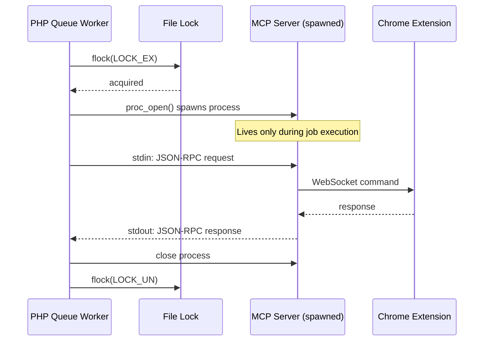
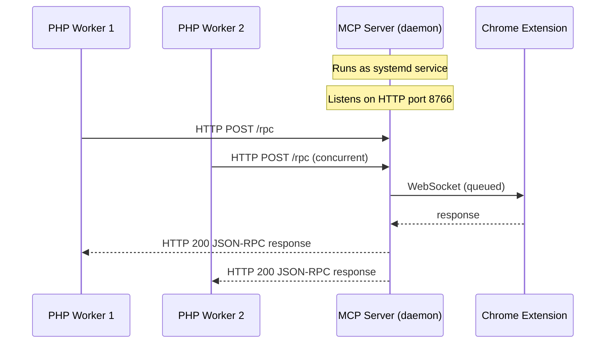

# HTTP Transport MCP Architecture

## Current Architecture (STDIO)



**Problems:**
- Each job spawns a new MCP process
- Lock contention between workers
- Suspended processes cause deadlock
- Process spawn overhead (~500ms per job)

---

## Proposed Architecture (HTTP Transport)



**Benefits:**
- No process spawning per job
- No file locking needed
- MCP server handles request queuing
- systemd handles crashes/restarts
- Multiple workers can connect simultaneously

---

## Implementation Requirements

### 1. MCP Server Changes (agent-jake-mcp)

Add HTTP transport alongside existing stdio:

```typescript
// Current: stdio only
const server = new McpServer({
  transport: 'stdio'
});

// New: HTTP transport option
const server = new McpServer({
  transport: process.env.MCP_TRANSPORT || 'stdio',
  httpPort: process.env.MCP_HTTP_PORT || 8766,
});
```

HTTP endpoints needed:
- `POST /rpc` - JSON-RPC 2.0 endpoint
- `GET /health` - Health check for systemd/monitoring
- `GET /status` - Connection status (WebSocket to extension)

### 2. systemd Service

```ini
# /etc/systemd/system/agent-jake-mcp.service
[Unit]
Description=Agent Jake MCP Server
After=network.target

[Service]
Type=simple
User=www-data
WorkingDirectory=/var/www/ai-email-sorter
ExecStart=/usr/bin/npx @anthropic-ai/agent-jake-mcp --transport=http --port=8766
Restart=always
RestartSec=5
Environment=NODE_ENV=production

# Health check
ExecStartPost=/bin/sleep 2
ExecStartPost=/usr/bin/curl -f http://localhost:8766/health

[Install]
WantedBy=multi-user.target
```

### 3. PHP Client Changes

Replace `proc_open` with HTTP client:

```php
// Before: McpClient spawns process
$client = new McpClient('npx @anthropic-ai/agent-jake-mcp');
$client->send($request);

// After: McpHttpClient connects to daemon
$client = new McpHttpClient('http://localhost:8766');
$response = $client->call('browser_click', ['ref' => 's1e42']);
```

### 4. Health Monitoring

Laravel scheduler or separate monitor:

```php
// Check MCP server health every minute
Schedule::call(function () {
    $response = Http::timeout(5)->get('http://localhost:8766/health');

    if (!$response->ok()) {
        // Alert or auto-restart
        exec('sudo systemctl restart agent-jake-mcp');
        Log::warning('MCP server restarted due to health check failure');
    }
})->everyMinute();
```

---

## Migration Path

### Phase 1: Add HTTP Transport to MCP Server
- Modify agent-jake-mcp to support `--transport=http`
- Keep stdio as default for backwards compatibility
- Add `/health` and `/rpc` endpoints

### Phase 2: Deploy as systemd Service
- Create systemd unit file
- Configure environment variables
- Set up log rotation

### Phase 3: Update PHP Client
- Create `McpHttpClient` class
- Update `AgentJakeMcpProcessManager` to use HTTP
- Remove file locking code

### Phase 4: Remove STDIO Support (optional)
- Once HTTP is proven stable
- Simplify codebase

---

## Comparison: STDIO vs HTTP

| Aspect | STDIO (Current) | HTTP (Proposed) |
|--------|-----------------|-----------------|
| Process lifecycle | Per-job spawn | Long-running daemon |
| Concurrency | Lock-based serialization | Server-side queuing |
| Failure recovery | Manual intervention | systemd auto-restart |
| Latency | ~500ms spawn overhead | ~10ms HTTP call |
| Complexity | Process management in PHP | systemd + HTTP client |
| Debugging | Hard (process per job) | Easy (single process, logs) |

---

## Questions to Resolve

1. **Request queuing**: Should MCP server queue browser commands or reject concurrent requests?
2. **Authentication**: Should HTTP endpoint require API key?
3. **Timeouts**: How to handle long-running browser operations over HTTP?
4. **WebSocket reconnection**: If extension disconnects, how does HTTP endpoint respond?

---

## Files to Create/Modify

| File | Action | Description |
|------|--------|-------------|
| `agent-jake-mcp/src/transports/http.ts` | CREATE | HTTP transport implementation |
| `agent-jake-mcp/src/server.ts` | MODIFY | Support transport selection |
| `agent-jake-mcp/package.json` | MODIFY | Add express/fastify dependency |
| `deploy/agent-jake-mcp.service` | CREATE | systemd unit file |
| `app/.../McpHttpClient.php` | CREATE | PHP HTTP client |
| `app/.../AgentJakeMcpProcessManager.php` | MODIFY | Use HTTP instead of stdio |
